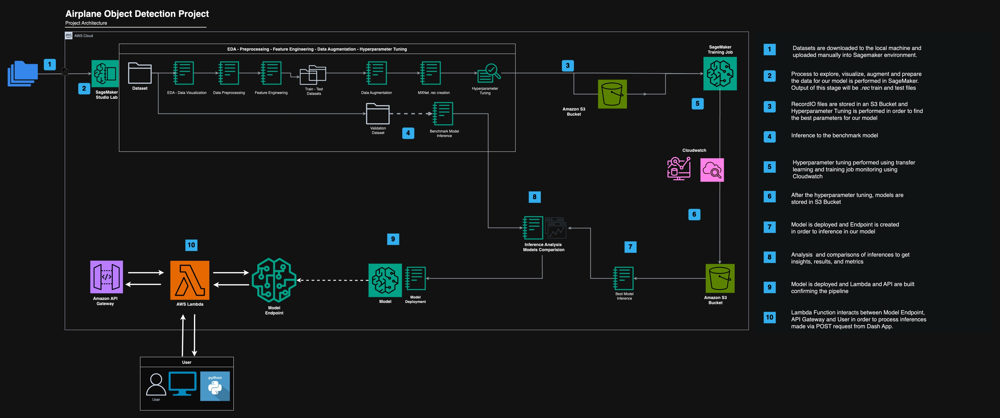
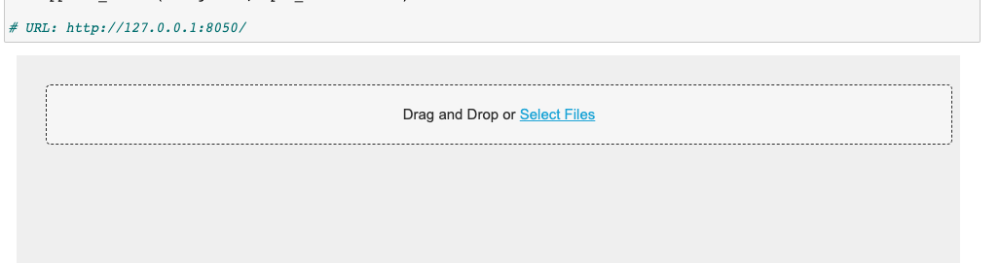
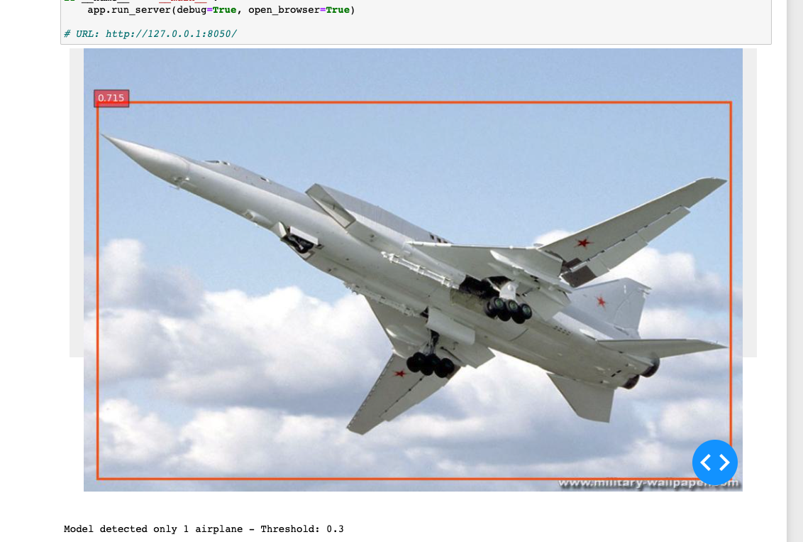
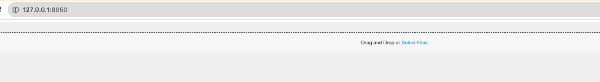
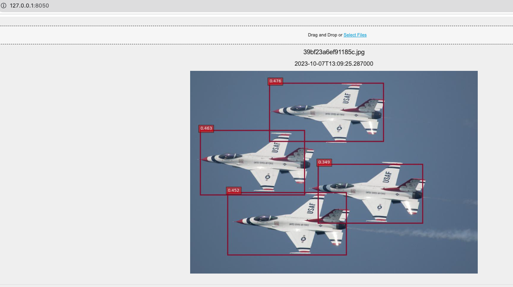

[](https://www.udacity.com/course/aws-machine-learning-engineer-nanodegree--nd189)

[](https://medium.com/@tbs89berlin)
[](https://www.linkedin.com/in/tomas-b-s)

[](https://opensource.org/licenses/MIT)


# AWS Machine Learning Engineer Nanodegree
## Airplane Object Detection - Capstone Project

### Author
Tomás Baidal

## Summary

This is the capstone project repository for the AWS Machine Learning Engineer Nanodegree from Udacity. This project serves as a comprehensive endeavor focusing on the deployment and utilization of Machine Learning models for object detection within images. Specifically, it embraces Apache MXNet ResNet 50, an open-source deep learning software framework, used for training, and deploying deep neural networks. It is particularly noteworthy for its capability to define, train, and deploy deep neural networks in a versatile and efficient manner, primarily focusing on cloud environments.

This project focuses on developing an object detection model using MXNet to identify airplanes in images, benchmarked against a TensorFlow reference model. Subsequently, the MXNet model was deployed on AWS, enabling real-time detection through a web application developed with Dash, AWS Lambda and AWS API Gateway.

## Project Structure Flowchart
<br><br>



<br><br>

## Stack

This project has been completely developed in <code>python 3</code> on AWS Sagemaker. We also used AWS Lambda, AWS API Gateway and Python Dash framework in order to develop a pipeline and an interface where the user can inference with the deployed model.

To run the notebooks and the app, please install the requirements.
```bash
pip install -r requirements.txt
```

The main libraries used are:


**Data Manipulation and Analysis**
```python
import pandas as pd 
import numpy as np 
```

**Utility and System**
```python
import os         
import shutil     
import json       
import importlib  
import zipfile    
import glob  
```


**Data Visualization**
```python
import matplotlib.pyplot as plt     
import matplotlib.pyplot as mpimg  
```

**Image Processing and Handling**
```python
from PIL import Image
import cv2
```


**Machine Learning and Data Splitting**
```python
from sklearn.model_selection import train_test_split 
```


**AWS Services and Machine Learning Deployment**
```python
import boto3  
import sagemaker
from sagemaker import get_execution_role  
from sagemaker import image_uris 
from sagemaker.tuner import CategoricalParameter, ContinuousParameter, HyperparameterTuner 
from sagemaker.debugger import Rule, rule_configs, ProfilerRule  
```

**Dash App Development**
```python
import dash
import dash_bootstrap_components as dbc
import dash_core_components as dcc
import dash_html_components as html
from dash import Dash, dcc, html, Input, Output, State, callback
from dash.dependencies import Input, Output, State
```


## Repository Structure

This project is composed by several notebooks and folders organized in the following way:

### Folder Structure
 
1. <code>utils</code>: folder with the funtioncs and scripts used in the notebooks and pipeline.
2. <code>data</code>: folder images and docs.
3. <code>AWS</code>: folder with the snapshots and scripts related to AWS Lambda and API Gateway


### Notebook Structure

1 - [<code>Data EDA Visualization</code>](01-data-eda-visualization.ipynb): Notebook that contains exploratory data analysis, first filtering and data visualization.

2 - [<code>Data Preprocessing</code>](02-data-preprocessing.ipynb): First data preprocessing, test dataset creation and filtered CSV's creation.

3 - [<code>Feature Modelling</code>](03-feature-modelling.ipynb): CSV's modelling for <code>lst</code> files creation.

4 - [<code>Data Augmentation</code>](04-data-augmentation.ipynb): Data Augmentation process.

  4.1 - [<code>Data Augmentation Demo</code>](04.1-data_augmentation_playground.ipynb): Explanation and demo of applied data augmention.

5 - [<code>Benchmark Model</code>](05-benchmark-model.ipynb): TensorFlow model inference

6 - [<code>MXNEt *RecordIO* Engineering</code>](06-mxnet-rec-engineering.ipynb): Generation of <code>.rec</code> files for our model.

7 - [<code>Hyperparameter Tuning - Model Deployment - Inference</code>](07-hyperparameter-tuning-model-deployment-inference.ipynb): Hyperparameter tuning jobs, model deployment and inference to our new model.

8 - [<code>Validation and Comparison of TensorFlow and MXNet Models</code>](08-validation-results-analysis.ipynb): Analysis of inferences and model comparision

9 - [<code>Model Selection and Endpoint Deployment</code>](09-endpoint-deployment-lambda-code.ipynb): New model endpoint deployment and inference testing

  9.1 - [<code>Test API Enndpoint Model</code>](AWS/09.1-test-api-endpoint-model.ipynb): Script to test locally the pipeline (Lambda <> API Gateway <> Model Endpoint)

10 - [<code>Python Dash App Development</code>](10-python-dash-app-development.ipynb): Dash App Development code. App will run in the notebook or locally in http://127.0.0.1:8050


### Dash App

Dash App will run when running the notebook [<code>Python Dash App Development</code>](10-python-dash-app-development.ipynb)

Images can be downloaded or dragged and dropped in the notebook and get inference:

  


Dash App will run on <code>http://127.0.0.1:8050/</code>:


  


## IMPORTANT

When creating the <code>RecordIO</code> files it is necessary to run the following commands before in order to use the script [<code>im2rec.py</code>](https://github.com/apache/mxnet/blob/master/tools/im2rec.py).

**The script code is licensed under the Apache License, Version 2.0 [](https://opensource.org/licenses/Apache-2.0). We are grateful to the authors for making their code available.**

```bash
import distro
if distro.id() == "debian":
    !apt-get update
    !apt-get install ffmpeg libsm6 libxext6 -y

import sys
!{sys.executable} -m pip install opencv-python
!{sys.executable} -m pip install mxnet
```

**It is also important to downgrade the numpy version when running the script as uses a deprecated numpy function**

```bash
pip install numpy==1.23.0
```


### References

Evaluation Metrics:
- https://jonathan-hui.medium.com/map-mean-average-precision-for-object-detection-45c121a31173
- https://www.researchgate.net/figure/mAP-Comparison-results-on-each-network-in-COCO-dataset_tbl6_348825339
- https://towardsdatascience.com/on-object-detection-metrics-with-worked-example-216f173ed31e

Object Detection:
- https://medium.com/visionwizard/object-detection-4bf3edadf07f
- https://jonathan-hui.medium.com/object-detection-series-24d03a12f904
- https://pub.towardsai.net/maximizing-the-impact-of-data-augmentation-effective-techniques-and-best-practices-c4cad9cd16e4

Deployment:
- https://austinlasseter.medium.com/deploying-a-dash-app-with-elastic-beanstalk-console-27a834ebe91d
- https://medium.com/@data.science.enthusiast/invoke-sagemaker-model-endpoint-with-aws-api-gateway-and-lambda-3d0c085dccb8

MXNet:
- https://github.com/apache/mxnet/tree/master
- https://github.com/apache/mxnet/blob/master/tools/im2rec.py


